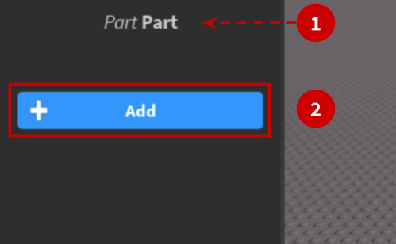
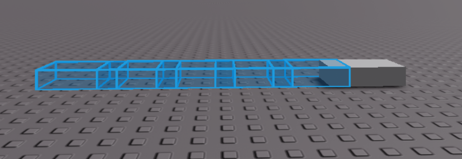
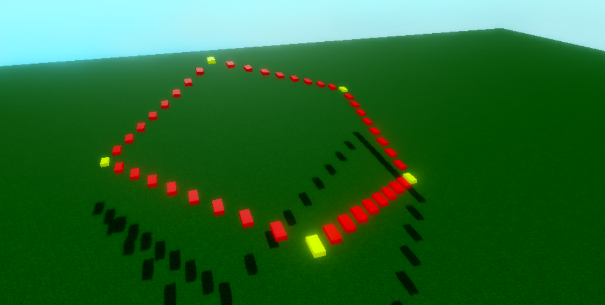
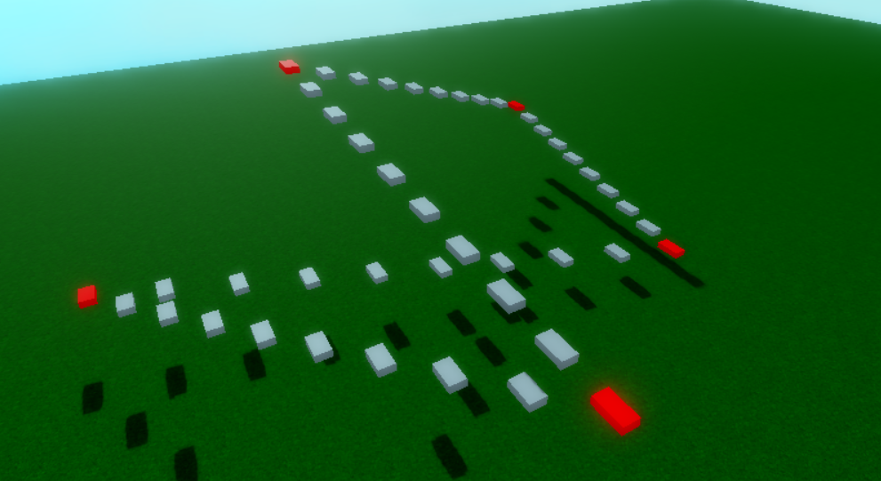
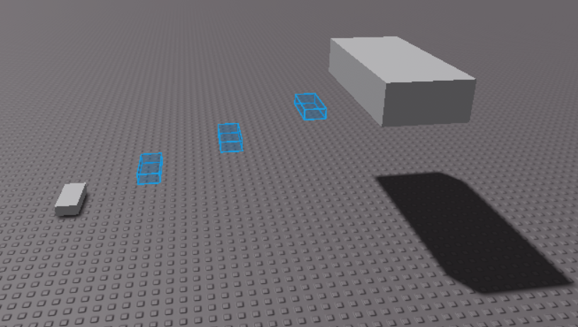
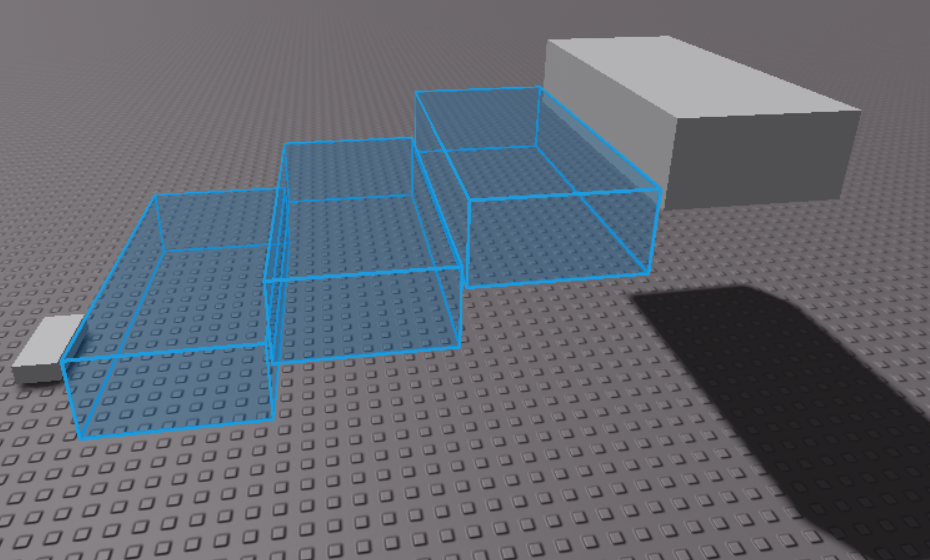
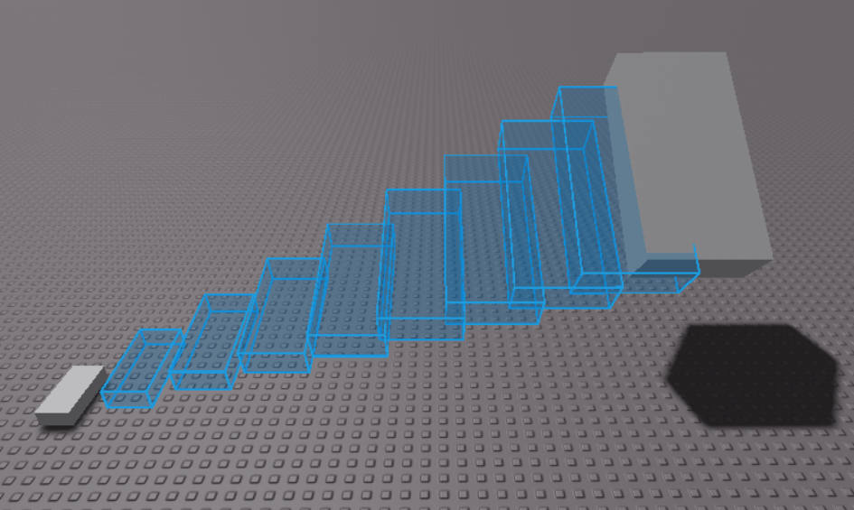
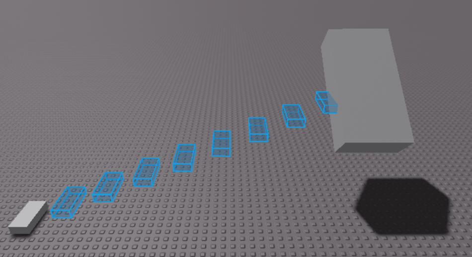
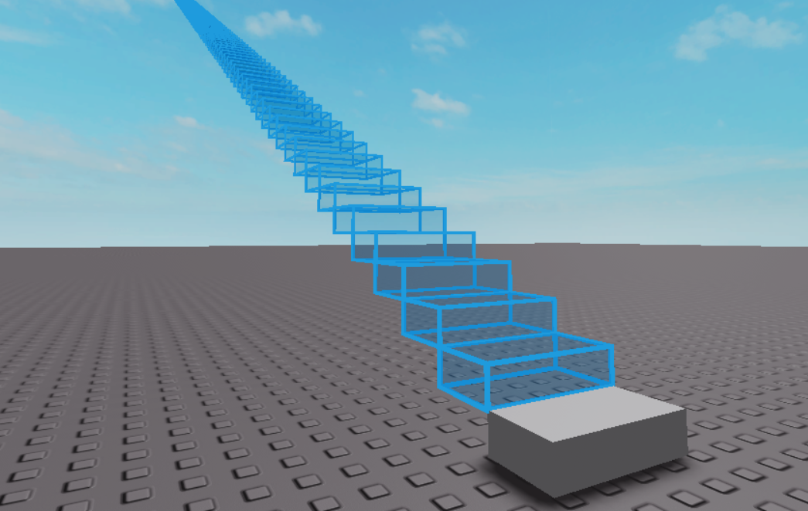
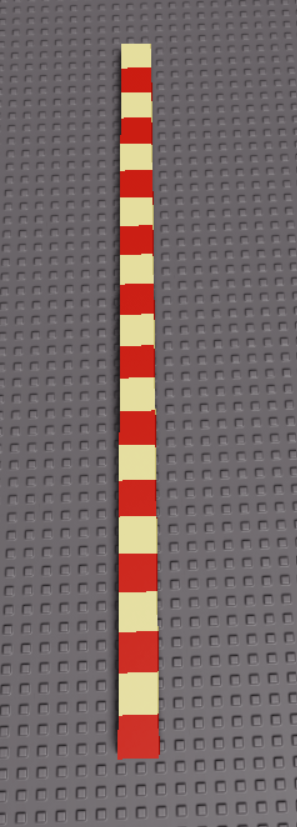

(**Get the plugin**)[https://www.roblox.com/library/6171221790/AMP-Array-Modifier-Plugin]
(**DevForum post**)[https://devforum.roblox.com/t/1-0-0-amp-array-modifier-plugin/956124?u=thecarbyneuniverse]

# AMP - Array Modifier Plugin

AMP is a plugin made to easily create arrays of parts to alleviate any need to manually perform repetitive steps. There are many features to suit almost any situation, and of course, I'll add more as time goes on.

Please note that this is my first plugin and therefore, there may be bugs I have overlooked. So, please be patient!
___

## Getting Started
Click [here](https://www.roblox.com/library/6171221790/AMP-Array-Modifier-Plugin) to install the plugin to Roblox Studio.

1. Open the widget by clicking on the plugin icon:

 

2. Select a part or multiple parts. 
3. The last part selected will be shown along with its class name [1]. Under it, you can add the modifier for all selected parts, by clicking on the corresponding button [2].

4. You will see all the settings currently available. Let us understand what each one does in the section below.

If you want to remove the modifier from the selected part, simply click on the button with the red trash-can icon at the bottom.

Also, notice the "Apply" button under the remove button. Until you click it, any change of settings will reflect only a *preview* of the result. To actually create the result, you must apply the modifier by clicking the button. Once you apply,  you cannot change the settings and you'll have to add the modifier to the part again.

To the left of the apply button, the button with the eye allows you to toggle (hide/show) the preview parts for the selected part.

Finally, if you want quick help without having to come here or the DevForum post, I've added a help widget. Simply click the question mark icon button in the plugin toolbar:

___
# Features

## Offset
There are two modes, which can both be on/off at the same time or have only one of them on.
* **Constant** - using studs to position each array part
* **Relative** - using factors of the size of the original part to create incrementally units

For each option, there are 3 input fields for the X, Y, and Z directions. Entering a positive number will shift them in the position direction while entering a negative number will shift them in the opposite direction.

Relative offset is useful when the size of the part is an inconvenient decimal to write out and you want a continuous array without gaps or overlaps. Inputting 0 as the factor will have the series of parts be exactly in the same position as the original one. Inputting 1 will shift them in that given direction and each array part will be exactly touching the adjacent one without overlapping. 

Since you can have constant and relative offset both on at the same time, you can tweak its behavior to better suit the situation. For example, by default, constant offset is a measure of the distance between the *center* of the previous array part and the current one. 

The part below is of size 4 in the X-direction. Offsetting it by 3 will leave a 1 stud overlap between each part.

If you want it to be distance between the *edges* of the parts, all you need to do is enable relative offset and input 1 for that given direction.

This is after setting the X relative offset to 1 while keeping the constant offset enabled. As you can see, now it's 3 studs between the *edges* of parts.

## Array Type
* **Fixed count** - create a set number of parts with a defined offset
* **Fit to length** - create as many parts as needed to fit a certain length with a defined offset
* **Endpoint incremental** - create a set number of parts between two "endpoint" parts where the offset is automatically set

The last one deserves a bit more explanation. It creates a series of parts between two selected parts, called endpoints. You do not need to input the offset for this as it will automatically be calculated based on the distance between the endpoints and the required count input. If either endpoint is moved, then the array of parts in between will be adjusted to stay on that imaginary "line" between them.

Unlike the other two types, endpoint incremental needs to have the count be n + 2 where n denotes the number of parts in between the two endpoints.

In update 1.1.1, I've added the ability to use endpoint incremental on 2+ parts! For example, you can create pentagonal structures:

It matters which order you select the parts, meaning it is safer to select parts one-by-one than drag-select. If you drag-select, then the array parts will not necessarily follow the outline of the shape:

These are the same parts as the image above this one, but the parts are selected in a different order.

### Endpoint 1 and Endpoint 2
This is the terminology I will use to describe the following behavior of endpoint incremental. After you have established a pair of endpoints (simply by having preview parts between them), you can select one of those endpoints to have them be endpoint 1. This will mean that the array parts will mimick endpoint. For example:

This is when the left part is selected last. It is set to Endpoint 1 and therefore, the array parts are small just like it.

On the contrary, since the large part is now endpoint 1, the array parts are also all large.

This behavior is a bit more complex with 2+ parts--if there's one endpoint connected to two separate endpoints (like in a triangle), any changes in endpoint1/endpoint 2 will reflect on both of those line of parts to those endpoints.

> **NOTE: This Endpoint 1 and 2 behavior will not occur with transform on (see below).**

## Transform
This is an optional feature that is only configurable when endpoint incremental is selected. By default, it is off, meaning the array parts between the endpoints do not update in size or orientation (they derive it from endpoint 1). When you enable the option, the array parts in between will incrementally scale and rotate from endpoint 1's transformation to endpoint 2's. Basically it's just how position is incremented, except setting transform to true will ensure that the size and orientation also gets incremented. 

> **NOTE: When you have transform enabled, it doesn't matter which endpoint is 1, it will function the same.**

Here is an example with tranform on:

The above image, since there are more parts, the increment between each part is small, thus it looks "smoother." It almost looks like a spiral staircase except that this one is in a linear fashion (I plan on adding curves to enchance the resulting structures).

And here is with it off:

> **NOTE: Endpoint incremental mode is in alpha, please use with patience. I plan to add more features to it and eliminate bugs.**

## Axis Type
* **Local** - use the vectors of the part's faces
* **Global** - use the world axes 

The difference between the two is seen when you rotate the original part. 

This is the result with local selected:

In local mode, the array parts move with the rotation of the original part and their axis is one of the part's face vectors (such as -Z being the look vector etc.).

In contrast, this is what happens when global is selected.

Global mode can be useful in certain cases if you just want the array parts to rotate while being stationary on a global axis. This will limit you to the 6 axis (+X, +Y, +Z, -X, -Y, and -Z) and diagonals are not possible.

> **Note: Axis Type is not configurable when endpoint incremental is selected.**
___
# Common Use Cases
Here are several common examples where array-type structure come in handy (and especially where such a convenient plugin comes in handy well!).

## Stairway to Heaven
* Relative offset only - (0, 1, 1)
* Count - 100

## Skyscraper windows
4 parts selected (in red)
* Relative offset - (0, 1, 0)
* Constant offset - (0, 1, 0)
* Count - 25

## Tiles
Place two parts adjacent to another another (set them to different colors); set these to both:
* Relative offset - (2, 0, 0)
* Count - 10

(This is only one row, so place more adjacent parts to create an entire tiled floor)
Here is the preview:

And here is the product:

___
# Other Info

## Current Issues
* Undo/redo isn't exactly "compatible" with this yet, so please be cautious when using it. If you undo, then the output may fill up with warnings stating the parent property of certain instances is locked. This is due to them already being destroyed, and hitting undo with try to revive them which will cause problems. This isn't a destructure issue, just an annoying one.
* I have not yet set up a system to filter all the text boxes yet, so refrain from entering invalid inputs such as a string.
* Other bugs not listed here will occur, especially since this is my first experience in creating and publishing a plugin. Please post it in the plugin release's DevForum post and include specific reproduction steps.

## Warnings
* AMP will insert a folder called "PreivewParts_AMP" in the workspace to store preview parts temporarily. It will automatically delete it once the plugin unloads. Please do not delete this folder manually to ensure the best function. I also have this as a friendly reminder inside of the folder if you expand it:

*  Upon installing the plugin, Studio will prompt you to allow or deny script injection permission. I don't know why that appears, but denying it will not allow the plugin to function.

## My Todo List
Priority levels:
[1]  - High (almost guaranteed)
[2] - Moderate (less guaranteed)
[3] - Low (not very likely)

- [ ] [1] Trying to work out the whole undo/redo situation
- [x] ~~[2] Allow endpoint incremental to work with 2+ parts e.g. selecting 3 parts will create a "triangle" of array parts in between.~~
- [ ] [3] Adding an object transformation mode to create more advanced structures
- [ ] [3] Adding a system to create curves to have the parts follow as opposed to simply a straight line

## Closure
Thank you all for using this plugin. I appreciate your patience with my novelty with plugins in advance! With reporting bugs or requesting features, just know beforehand that I am considering all feedback, but I may be delayed in delivering a response and/or the update.

(If you are reading this on the day of release then Happy New Year!)

___
*(c) TheCarbyneUniverse 2020-21*

*All rights reserved.*
